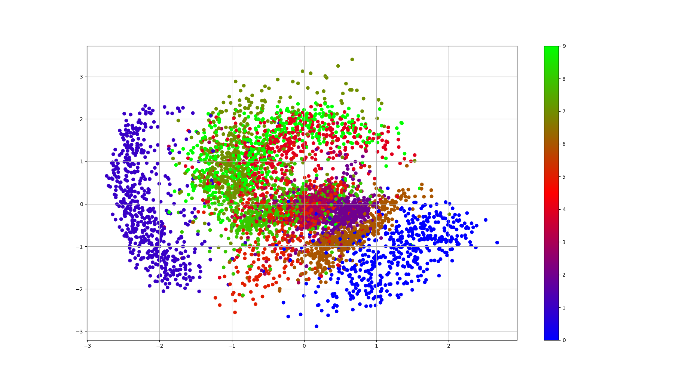
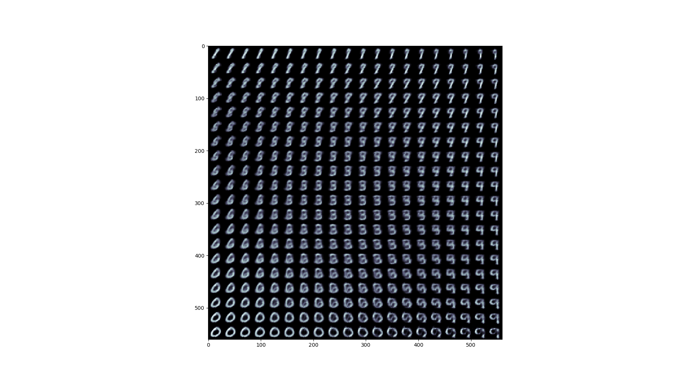
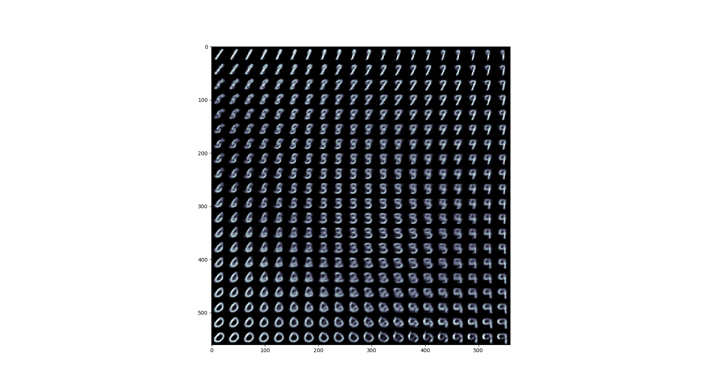
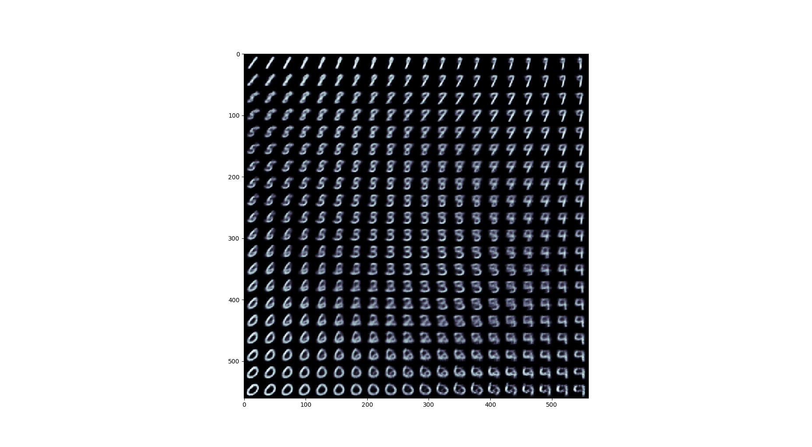
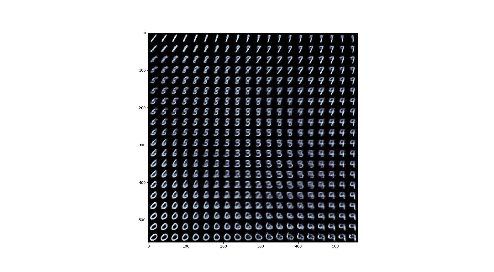

# Variational-Auto-Encoder
Tensorflow implementation of Variational Auto-Encoder

Explanation on Variational Autoencoders is in my blog [post](https://mohitjain.me/2018/10/26/variational-autoencoder/).

## Content

- `vae.py`: Implementation of Variational Autoencoder
- `layers.py`: Contains implementation of basic layers required.
- `main.py`: Code for training VAE and generating new samples.

## Results

#### Visualization of the latent space:
After 20 epochs.

#### Visualization of the 2D Latent Space Manifold during training:

Epoch-5

Epoch-10
 
Epoch-15

Epoch-20
 

